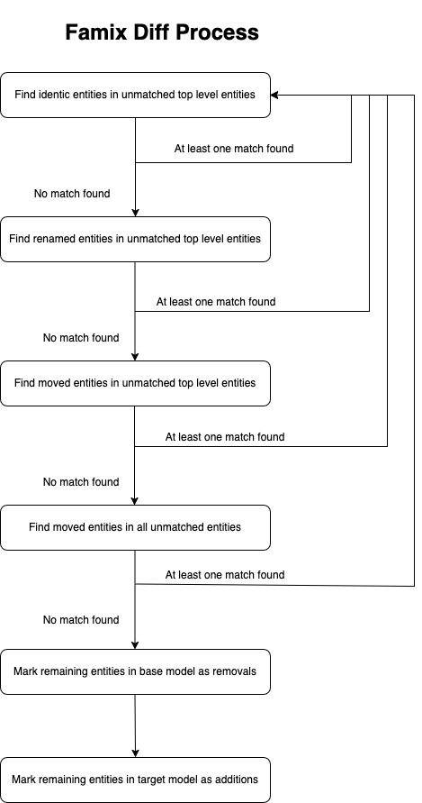

# FamixDiff: Developer Documentation

The computation of the diff happens in the class `FamixDiffResolver` and is triggered via the method `#computeDiff`.

We start by computing the diff between entities, followed by computing the diff between associations.

<!-- TOC -->

- [FamixDiff: Developer Documentation](#famixdiff-developer-documentation)
	- [Diff between entities](#diff-between-entities)
		- [General diff logic](#general-diff-logic)
		- [Comparison logic](#comparison-logic)
			- [Customizing the comparison based on the metamodel](#customizing-the-comparison-based-on-the-metamodel)
		- [Optimization logic](#optimization-logic)
	- [Diff between associations](#diff-between-associations)

<!-- /TOC -->

## Diff between entities

First, we compute the diff between entities.

This step can be challenging for multiple reasons and requires extensive optimizations to be time-efficient. We will present these mechanisms in this section.

### General diff logic

<p align="center">
  
</p>

The first step in comparing entities is to take the unmatched root entities of a model. This means selecting, from both the base model and the target model, all entities that have no unmatched parent. In the first iteration, this means taking the root entities of both models.

Once we have these entities, we iterate over all the top entities from the base model and attempt to find identical entities among the top entities from the target model. The process for doing this is explained in the [Comparison logic](#comparison-logic) section. When we find an identical entity, we produce a `FamixUnchangedChange` for it.

This step can have two possible outcomes:
- If we find matches, we restart this step with the new unmatched top entities from both models.
- If we do not find any matches, we proceed to the second step.

In the second step, we look for renamed entities among the top unmatched entities. Again, two outcomes are possible:
- If we find matches, we return to step 1 with the new unmatched top entities and search for identical entities again.
- If we do not find any matches, we proceed to the third step.

In the third step, we look for moved entities among the top unmatched entities. Again, two outcomes are possible:
- If we find matches, we return to step 1 with the new unmatched top entities and search for identical entities again.
- If we do not find any matches, we proceed to the fourth step.

If we cannot find any identical, renamed, or moved entities among the top-level entities, we check whether any entities may have moved deeper within the hierarchy of the target model. If we find any, we retry the entire process on the remaining top entities. Otherwise, we finalize the analysis.

Once we can no longer find matching entities, we consider the remaining entities from the source model as removed and the remaining entities from the target model as added.

### Comparison logic

To determine whether entities are identical, renamed, or moved, we need to compare them. Since these comparisons must be effective across all languages and handle different types of entities, we customize them based on the Famix traits they use. For example, `FamixTNamedEntity` must consider the entity's name when comparing. If an entity is identical or moved, the name must be the same; for renamed entities, the name must be different.

We manage this using a pragma called `#famixDiff:priority:`. If we want a property to be compared between two entities, we implement a method that takes two parameters:
- The entity to compare the receiver with.
- The resolver, which can be useful in some cases (explained later).

This comparison method must include the `#famixDiff:priority:` pragma. The first parameter defines when to use this comparison method; it should be a symbol (`#identity`, `#rename`, or `#move`). The second parameter is an integer used for optimization since some criteria are faster to compare (e.g., comparing the class of two entities is faster than comparing their dependencies).

Example:

```st
FamixTNamedEntity>>compareNameWith: otherEntity resolver: aResolver

	<famixDiff: #identity priority: 3>
	<famixDiff: #move priority: 3>
	^ self name = otherEntity name
```

This method on `FamixTNamedEntity` is used to compare the identity or movement of an entity.

As mentioned earlier, the resolver can also be useful. For example, when comparing the parents of an entity, we cannot simply compare their names if a parent has been renamed. However, the resolver tracks renamed entities (since we compare from top to bottom, parents are matched before their children).

```st
TEntityMetaLevelDependency>>compareParentsWith: otherEntity resolver: resolver

	"I check that the parents of both entities are the same."

	<famixDiff: #identity priority: 5>
	<famixDiff: #rename priority: 5>
	| baseParents targetParents |
	baseParents := self parents.
	targetParents := otherEntity parents.

	baseParents size = targetParents size ifFalse: [ ^ false ].

	baseParents do: [ :baseParent | 
		targetParents
			detect: [ :targetParent | "We delegate the comparison to the resolver because it's possible a parent is the same but got renamed. This should deal with this case." 
				resolver is: baseParent sameAs: targetParent ]
			ifNone: [ ^ false "A parent of the base entity does not have a matching parent so we escape." ] ].

	^ true
  ```

Here, instead of directly comparing parent names, we ask the resolver to manage renaming cases.

#### Customizing the comparison based on the metamodel

If a specific metamodel has unique characteristics that should be considered in the comparison, it is possible to add comparison methods on a Famix trait or directly on concrete entities, as long as they include at least one `#famixDiff:priority:` pragma.

### Optimization logic

FamixDiff needs to perform an enormous number of comparisons between entities—potentially billions of times on a mid-sized project. Initially, running the algorithm on a mid-sized project took 3 hours because it constantly retrieved pragmas from entities before applying comparisons.

A first optimization was to cache the methods to execute (i.e., the methods with the relevant pragmas) in a dictionary for each type of entity in the model. Once the algorithm finished, this cache was discarded. This reduced execution time from 3 hours to 20 minutes, but most of the time was still spent accessing the cache.

The current implementation uses a more aggressive optimization. Instead of caching, for each type of entity, the first comparison triggers a method that does not exist in the system. FamixDiff catches the resulting `MessageNotUnderstood` error, collects the relevant pragmas for that entity type, dynamically compiles a method with all the required comparisons, and then calls it. Subsequent comparisons for that entity type use the compiled method directly.

This is done as follows:

```st
TEntityMetaLevelDependency>>identityMatch: otherEntity resolver: resolver
	"We consider that the entities are identical if all comparators declared for the entity with the following pragma are matching."

	"The code here is a little weird but it is for performance reasons. Each entity will apply some filters to know if they are identical or not. Those filters are implemented on different traits composing the entities and we collect them via a pragma. But it takes some time to collect them.
	In order to speed up things, the first time we get here for a specific class, we will have a message not understood and we will generate a method collecting all the filters and applying them.
	Once the computation is finished, the resolver will remove this generated code from the system."
	^ [ self isIdenticalTo: otherEntity resolver: resolver ]
		  on: MessageNotUnderstood
		  do: [
			  self generateMethodNamed: #isIdenticalTo:resolver: basedOnPragmaName: #identity.
			  self isIdenticalTo: otherEntity resolver: resolver ]
```

For example, in a Java model, if the entity type is `FamixJavaPackage`, the dynamically generated method would look like this:

```st
FamixJavaPackage>>isIdenticalTo: otherEntity resolver: resolver

	(self hasSameClassAs: otherEntity resolver: resolver) ifFalse: [ ^ false ].
	(self compareNameWith: otherEntity resolver: resolver) ifFalse: [ ^ false ].
	(self compareParentsWith: otherEntity resolver: resolver) ifFalse: [ ^ false ].
	 ^ true
```

Once the algorithm finishes, all dynamically generated code is removed. This eliminates the need for developers to invalidate caches when updating comparison methods. This is done in `FamixDiffResolver>>#removeFamixDiffCaches`.

## Diff between associations

For now, the comparison of associations is relatively simple and is handled by `#computeDiffBetweenAssociations`.

This method iterates over all detected entity changes:

- If the change is a `FamixAddChange`, it retrieves the entity’s outgoing dependencies and marks them as new.
- If the change is a `FamixRemovalChange`, it retrieves the entity’s outgoing dependencies and marks them as removed.
- Otherwise, it compares associations in both versions of the entity to determine which dependencies were added or removed using `FamixTAssociation>>#matches:resolver:`.
